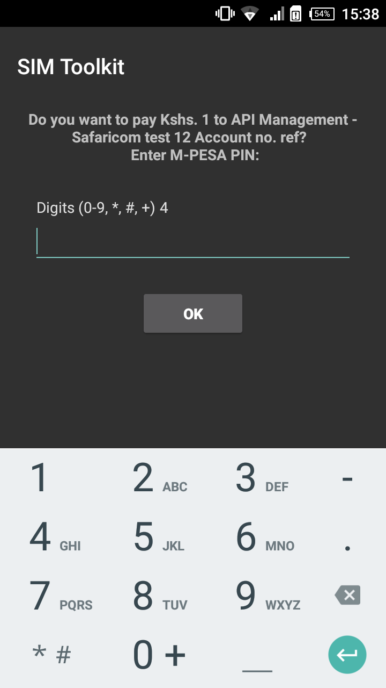

# MpesaLib [](https://www.myget.org/)
 
MPESA API LIBRARY For C# Developers

ONLY ASP.NET CORE Tested!!

* This documentation is only meant to help you get started on how to use this library and does not explain MPESA APIs and there internal workings or exemplifications of when and where you might want to use any of them. If you need some indepth explanation on how these Mpesa APIs work you can checkout this link ---> https://peternjeru.co.ke/safdaraja. Otherwise Safaricoms developer portal should get you sufficient detail.

Explore All existing MPESA APIs and how to generate your API Keys at Daraja - [Safaricom's Developer Portal](https://developer.safaricom.co.ke/apis-explorer)

## Note
* *Access tokens generated by the [Authclient](https://github.com/ayiemba/MpesaLib/blob/master/src/MpesaLib/Clients/AuthClient.cs) expire after an hour (this is documented in Daraja).* 


* *Users of MpesaLib should ensure they handle token expriration in their code. A quick solution would be to put the semaphore in a try/catch/finally block as documented in [this question](https://stackoverflow.com/questions/49304326/refresh-token-using-static-httpclient) from stackoverflow.*

## 1. HOW TO USE In an ASP.NET Core Web Application

* Run `Install-Package MpesaLib -Version 1.0.8` in Package Manager Console or go to Manage Nuget Packages, Search and install MpesaLib
* Add usings 
```c# 
using MpesaLib.Clients; //gives you the clients
using MpesaLib.Interfaces; //gives you the interfaces for use in DI
using MpesaLib.Models; //gives the DTOs for each client
```
* Add Mpesa API Clients in DI Container; For asp.net core core this can be done in Startup.cs.
There are about 10 mpesa api clients. Only register and use the specific ones you need in your code. If you can abstract them behind a helper method the better for you especially if you dont want to litter Startup.cs with too many services.AddHttpClient<>();

```c#
    //Add AuthClient - gets you accesstokens (This is manadatory)
    services.AddHttpClient<IAuthClient, AuthClient>();
    
    //Add LipaNaMpesaOnlineClient - makes STK Push payment requests
    services.AddHttpClient<ILipaNaMpesaOnlineClient, LipaNaMpesaOnlineClient>();
    
    //Add C2BRegisterUrlClient - register your callback URLS, goes hand-in-hand with the C2BClient
    services.AddHttpClient<IC2BRegisterUrlClient, C2BRegisterUrlClient>();
    
    //Add C2BClient - makes customer to business payment requests 
    services.AddHttpClient<IC2BClient, C2BClient>();
    
    //Add B2BClient - makes business to business payment requests
    services.AddHttpClient<IB2BClient, B2BClient>();
    
    //Add B2CClient - makes business to customer payment requests
    services.AddHttpClient<IB2CClient, B2CClient>();
    
    //Add LipaNaMpesaQueryClient - Query status of a LipaNaMpesaOnline Payment request
    services.AddHttpClient<ILipaNaMpesaQueryClient, LipaNaMpesaQueryClient>();
    
    //Add TransactionReversalClient - Reverses Mpesa transactions
    services.AddHttpClient<ITransactionReversalClient, TransactionReversalClient>();
    
    //Add TransactionStatusClient - Query status of transaction requests
    services.AddHttpClient<ITransactionStatusClient, TransactionStatusClient>();  
    
     //Add AccountBalanceQueryCient - Query Mpesa balance
    services.AddHttpClient<IAccountBalanceQueryCient, AccountBalanceQueryCient>(); 
    
```
* Inject the clients in your controller of any class that does the api calls... (in this case am using the AuthClient and LipaNaMpesaOnlineClient. I store my API Keys and secrets in a configuration file in this case appsettings.json.

```c#
    public class PaymentsController : Controller
    {
        private readonly AuthClient _auth;
        private LipaNaMpesaOnlineClient _lipaNaMpesa;        
        private readonly IConfiguration _config;

        public PaymentsController(AuthClient auth, LipaNaMpesaOnlineClient lipaNampesa, IConfiguration configuration)
        {
            _auth = auth;
            _lipaNaMpesa = lipaNampesa;            
            _config = configuration;
        }
        ...
        //Code omitted for brevity
```
* You can store your ConsumerKey and ConsumerSecret in appsettings.json as follows

```json
     "MpesaConfiguration": {
         "ConsumerKey": "[Your Mpesa ConsumerKey from daraja]",
         "ConsumerSecret": "[Your Mpesa ConsumerSecret from daraja]"
       }
```

* Generate `accesstoken` using the AuthClient

```c#
        // GET: /<controller>/
        public async Task<IActionResult> Index()
        {
            var consumerKey = _config["MpesaConfiguration:ConsumerKey"];

            var consumerSecret = _config["MpesaConfiguration:ConsumerSecret"];

            var accesstoken = await _auth.GetToken(consumerKey,consumerSecret);
            
            ...
        //code omitted for brevity
```

* To use Send Request to LipaNaMpesaOnline, initialize the LipaNaMpesaOnline object by providing values for it's properties

```c#
      LipaNaMpesaOnline lipaonline = new LipaNaMpesaOnline
      {
          AccountReference = "test",
          Amount = "1",
          PartyA = "254708374149",
          PartyB = "174379",
          BusinessShortCode = "174379",
          CallBackURL = "[your callback url, i wish i could help but you'll have to write your own]",
          Password = "daraga explains on how to get password",
          PhoneNumber = "254708374149",
          Timestamp = "20180716124916",//DateTime.Now.ToString("yyyyMMddHHmmss"),
          TransactionDesc = "test"
          TransactionType = "CustomerPayBillOnline" //I am using this by default, you might wanna check the other option
      };
```

* You can then make a payment request in your controller as follows..

```c#
var paymentrequest = await _lipaNaMpesa.MakePayment(lipaonline, accesstoken);
```

* (Not Recommended) - If you dont want to use Dependency Injection you can just New-Up the clients and use them like this..
```c#
   LipaNaMpesaOnlineClient LipaNaMpesa = new LipaNaMpesaOnlineClient();
   ...
   ...
   var paymentrequest = await LipaNaMpesa.MakePayment(lipaonline, accesstoken);
```
* Do whatever you want with the results of the request... (Of cos i plan to make these docs better in the future)


## 2. A Quick and Cheeky Way to test Using Console App:
```c#
using MpesaLib.Clients;
using MpesaLib.Models;
using System;
using System.Net.Http;
using System.Threading.Tasks;

namespace ConsoleApp1
{
    class Program
    {
        

        static void  Main(string[] args)
        {
            Console.WriteLine("Mpesa API Test ..."); 
            
            MakePaymentAsync().GetAwaiter().GetResult(); 

            Console.WriteLine("Press Any Key to Exit..");

            Console.ReadKey();

        }

        static async Task<string> MakePaymentAsync()
        {
            string ConsumerSecret = "your consumer secret from daraja";
            string ConsumerKey = "your consumer key from daraja";

            var httpClient = new HttpClient(); //NOT A GOOD IDEA!!
           
            AuthClient Auth = new AuthClient(httpClient);   //Your have to pass in httpClient to all the MpesaLib clients.        

            string accesstoken = await Auth.GetToken(ConsumerKey, ConsumerSecret); //this will get you a token

            var LipaNaMpesaOnline = new LipaNaMpesaOnline
            {
                AccountReference = "test",
                Amount = "1",
                PartyA = "2547xxxxxxxx", //replace with your number
                PartyB = "174379",
                BusinessShortCode = "174379",
                CallBackURL = "https://use-your-own-callback-url/api/callback", //you should implement your own callback url, can be an api controller with a post method taking in a JToken (I gave you a big hint!!)
                Password = "use your own password",
                PhoneNumber = "254xxxxxxx", //same as PartyA
                Timestamp = "20180716124916", // replace with timestamp used to generate password
                TransactionDesc = "test"

            };

            LipaNaMpesaOnlineClient lipaonline = new LipaNaMpesaOnlineClient(httpClient);   //initialize the LipaNaMpesaOnlineClient()                

            var paymentdata = lipaonline.MakePayment(LipaNaMpesaOnline, accesstoken);// this will make the STK Push and if you use your personal number you should see that on your phone. If you complete the payment it will be reversed.           

            return paymentdata.ToString(); // you can return or log to console, in a real app there is plenty that you still need to do 
        }

    }
}

```
You should see this from your phone if you did it right...

