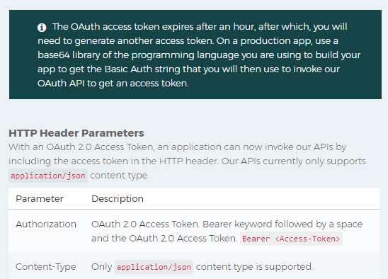

# MpesaLib    

 
  MPESA API LIBRARY For C# Developers

* This Library is work in progress.
* Pull requests are accepted!
* Library is based on .NET Standard 2.0
* Will be deployed as a NUGET Package in the near future...
* This is a pet project, and is fully open source

Explore All existing MPESA APIs and how to generate your API Keys at Daraja - [Safaricom's Developer Portal](https://developer.safaricom.co.ke/apis-explorer)

## Note
* *Access tokens generated by the [Authclient](https://github.com/ayiemba/MpesaLib/blob/master/src/MpesaLib/Clients/AuthClient.cs) expire after an hour (this is documented in Daraja).* 

* *Users of MpesaLib should ensure they handle token expriration in their code. A quick solution would be to put the semaphore in a try/catch/finally block as documented in [this question](https://stackoverflow.com/questions/49304326/refresh-token-using-static-httpclient) from stackoverflow.*
